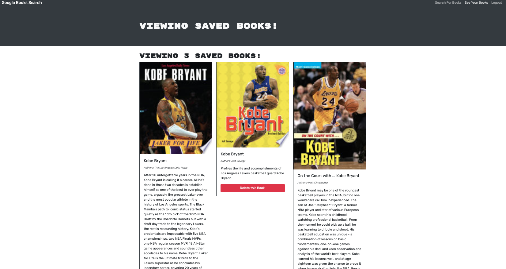
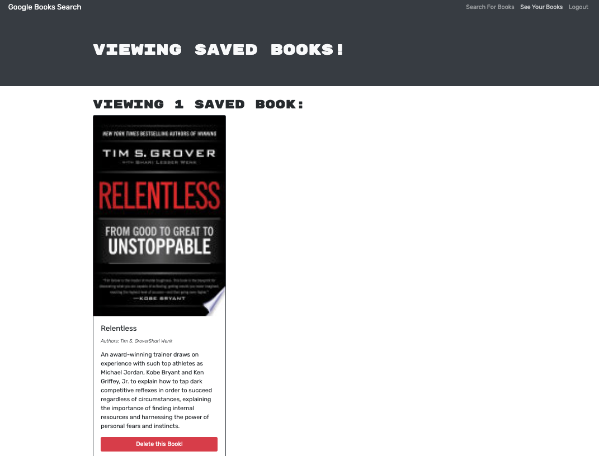

[](https://opensource.org/licenses/MIT)
# Book Search Engine
# Description
A Google Books API search engine built with a RESTful API, and refactor it to be a GraphQL API. Built with Apollo Server. Where users can search for books and saved them in their accounts.

## Table of Contents
* [Installation](#installation)
* [Usage](#usage)
* [License](#license)
* [Contribution](#contribution)
* [Tests](#tests)
* [Questions](#questions)

## Installation

```
Clone this repository.  From the command line, run npm i.  Then run npm run develop.
```

## Usage

[Book Search Engine -- Application Link -- Click here](https://boiling-tundra-77661.herokuapp.com/)

Login or Signup:


Search Books:


Save Books:



Remove Books:

  

## License
Book Search Engine is covered under the MIT license.

## Contribution
None at this time.

## Tests

```
Not Applicable.
```

## Questions

If you have any questions about the application, please contact me directly @ Ian.Li1023@gmail.com.

You can also visit my pages below!!

** Github Username: IanLi1023

** Github Profile: www.github.com/IanLi1023
